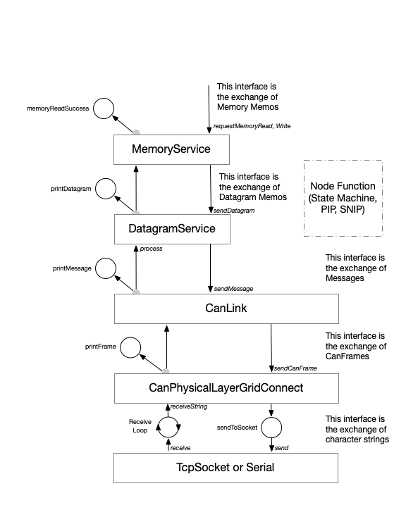

.. python-openlcb documentation master file, created by
   sphinx-quickstart on Thu May 16 16:30:21 2024.
   You can adapt this file completely to your liking, but it should at least
   contain the root `toctree` directive.

Welcome to python-openlcb's documentation!
==========================================
.. autosummary::
   :toctree: _autosummary
   :template: custom-module-template.rst
   :recursive:

   openlcb

.. toctree::
   :maxdepth: 2
   :caption: Contents:

For how this documentation is built into html, see README.md or create a github workflow to publish it to readthedocs.io.

For general info on how the "docbuild" was configured, see the following sources which where used:

- Install Sphinx: https://www.sphinx-doc.org/en/master/usage/installation.html

- Setup autodoc: https://eikonomega.medium.com/getting-started-with-sphinx-autodoc-part-1-2cebbbca5365

- Setup recursive gathering of docstrings using autosummary: https://stackoverflow.com/a/62613202/4541104

Instructions for adding new documentation:

- Use Google-style docstrings (Sphinx will automatically generate documentation sections for such docstrings when `make html` runs).

- For bullet lists within docstrings, reStructuredText must be used (blank line before each bullet).

- For additional text that is manually entered (not generated from docstrings),
  use the reStructuredText format and add data to this file or other rst files
  (in the "doc" folder in the case of this project, as configured in make.bat
  and Makefile).

Indices and tables
==================

* :ref:`genindex`
* :ref:`modindex`
* :ref:`search`
